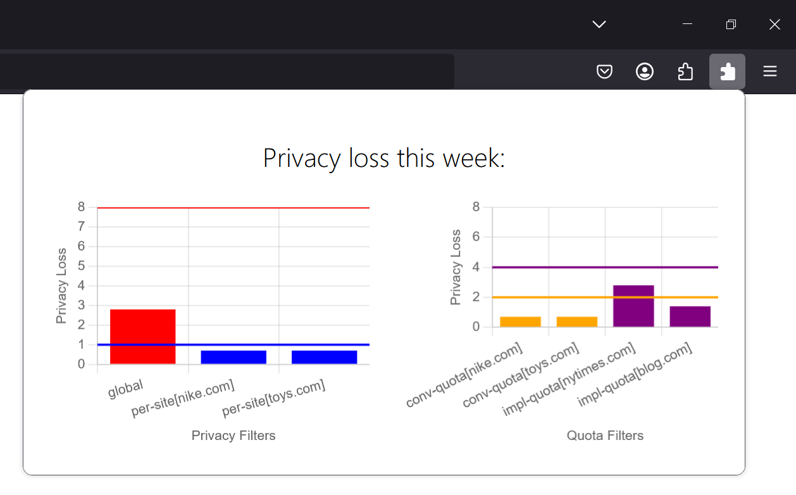

# Private Data Service Library

`pdslib` is a Rust library that implements on-device differential privacy (DP) budgeting for privacy-preserving attribution measurement APIs such as the W3C's [PPA](https://w3c.github.io/ppa/), [Cookie Monster](https://arxiv.org/abs/2405.16719) or [Big Bird](https://arxiv.org/abs/2506.05290). It aims to remain more generic than Web advertising use cases, exposing a relatively abstract interface for: (1) storing events, such as impressions for PPA but also other personal-data-events like locations the user has visited previously, and (2) requesting reports computed based on previously stored events, such as conversion attribution reports for PPA or also whether the user visited a particular location previously.

## State and versions

The library is currently under active development and is highly experimental. The most experimental APIs and algorithms, as well as some debugging APIs, are behind an `experimental` feature flag.
This repository contains the following releases:

- The upcoming [v0.3 - Big Bird](https://github.com/columbia/pdslib/releases) release implements the [Big Bird algorithm](https://arxiv.org/abs/2506.05290).
    - Big Bird is an extension to PPA and Cookie Monster that supports and manages privacy budgets for different sites while maintaining global privacy guarantees against colluding sites. Big Bird preserves both user privacy and isolation among queriers competing for privacy budget on user devices. 
    - This release builds on [Cookie Monster algorithm](https://arxiv.org/abs/2405.16719) for individual privacy loss accounting (Section 3.3 of the linked paper), whose main logic is implemented in [src/pds/accounting.rs](https://github.com/columbia/pdslib/blob/e54c363fcdf3761df63dfb4cb025c5fe92cc571f/src/pds/accounting.rs). 
    - The Big Bird privacy management layer is mainly implemented in [src/pds/core.rs](https://github.com/columbia/pdslib/blob/e54c363fcdf3761df63dfb4cb025c5fe92cc571f/src/pds/core.rs), with external entrypoints at [src/pds/private_data_service.rs](https://github.com/columbia/pdslib/blob/e54c363fcdf3761df63dfb4cb025c5fe92cc571f/src/pds/private_data_service.rs) and [src/pds/batch_pds.rs](https://github.com/columbia/pdslib/blob/e54c363fcdf3761df63dfb4cb025c5fe92cc571f/src/pds/batch_pds.rs).
- The [v0.2 - Cookie Monster](https://github.com/columbia/pdslib/tree/19eee219404e90b8529138137e3f8430f06a78ee) release is an older release that implements Cookie Monster only. 
    - The purpose of this release is to help with understanding of the Cookie Monster algorithm, however please note that because the repository is still very much under development and experimental, we urge that you do not rely on it for implementations of PPA. File [src/pds/epoch_pds.rs](https://github.com/columbia/pdslib/blob/19eee219404e90b8529138137e3f8430f06a78ee/src/pds/epoch_pds.rs) implements the Cookie Monster algorithm. 
    - A test case that shows how to use the library in the context of PPA Level 1 is in [tests/ppa_workflow.rs](https://github.com/columbia/pdslib/blob/19eee219404e90b8529138137e3f8430f06a78ee/tests/ppa_workflow.rs). 
    - This version of pdslib implements privacy loss accounting against a single privacy filter (a.k.a., `budget`), for example for a single advertiser. To support multiple privacy filters (such as one per advertiser, as dictated by the Cookie Monster paper and in PPA Level 1), one would instantiate multiple pdslibs. No support is provided in this version for management of these different pdslib instances. 

## Integrations

We provide an example integration of pdslib into Firefox at [columbia/pdslib-firefox](https://github.com/columbia/pdslib-firefox). This integration comes with a companion Firefox extension, at [columbia/pdslib-firefox-extension](https://github.com/columbia/pdslib-firefox-extension), that displays a privacy dashboard (see screenshot below). Section 5 and Appendix E of the [Big Bird paper](https://arxiv.org/abs/2506.05290) give more details about our Firefox integration.

We are also experimenting with a prototype integration of pdslib into Android.

## Repository structure
- `src` contains the following main components: `budget`, `events`, `mechanisms` (no dependencies), `queries` (depends on `budget`, `events`, `mechanisms`) and `pds` (depends on the rest).
    - `src/*/traits.rs` define interfaces. Other files in `src/*` implement these interfaces, with simple in-memory datastructures for now, such as [HashMapFilterStorage](https://github.com/columbia/pdslib/blob/e54c363fcdf3761df63dfb4cb025c5fe92cc571f/src/budget/hashmap_filter_storage.rs#L10). Other crates using pdslib in particular environments (e.g., Firefox or Android) can have implementations for the same traits using browser storage or SQLite databases.
    - `src/pds` is structured to work with `budget`, `events`, `queries` only through interfaces. This should allow customers to swap the implementation for event storage or replace the type of query, and still obtain a working implementation of the `PrivateDataService` interface.
    - `src/events/ppa_event.rs` and `src/queries/ppa_histogram.rs` provide concrete implementations of the pdslib interfaces for PPA-like events and queries, which are used to evaluate Big Bird.
- `tests` contains integration tests. In particular, `tests/*_demo.rs` show how an external application can use pdslib to register events and request different types of reports on a device. 
